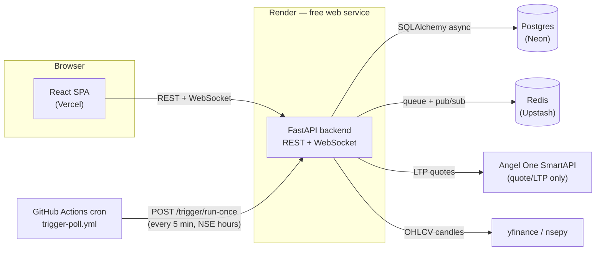

# QuantForge

No-code, AI-augmented algorithmic trading platform: live/historical charting, a
drag-and-drop visual strategy builder, backtesting with real quant metrics,
and a paper-trading execution pipeline with a live dashboard.

Academic project (CSE-DS) — deliberately spans full-stack dev, data
engineering, ML/RL, quant finance, distributed systems, DB design, and
software architecture rather than staying in one lane.

> **Non-negotiable:** this system only ever *simulates* fills using
> live/historical market data. It never calls a broker's live
> order-placement endpoint, in any phase. See `CLAUDE.md`'s "Paper trading"
> section for details.

See [`CLAUDE.md`](./CLAUDE.md) for the full spec, stack, and per-phase
architecture decisions, and [`docs/PROMPTS.md`](./docs/PROMPTS.md) for the
phase-by-phase build plan this project follows.

**Live deployment:**
[quantforge-blond.vercel.app](https://quantforge-blond.vercel.app) (frontend) ·
[quantforge-t0cf.onrender.com](https://quantforge-t0cf.onrender.com/health) (backend `/health`)

## Architecture



The backend is one FastAPI process serving the REST API, the Phase 8
dashboard WebSocket, *and* `POST /trigger/run-once` — the single-hit
Trigger+Executor cycle a scheduled GitHub Action calls on a timer, because
Render's free tier sleeps on idle and can't host a persistent polling loop
(see "Deployment" below, and CLAUDE.md's "Loop vs. single-hit" section for
the always-on-VM alternative this project also supports).

## Stack

| Layer | Choice |
|---|---|
| Frontend | React + Vite + TypeScript + Tailwind → **Vercel** |
| Charting | TradingView `lightweight-charts` |
| Strategy builder | React Flow |
| Dashboard charts | Recharts |
| Backend | FastAPI (Python 3.12) → **Render** (free web service) |
| Scheduled Trigger/Executor | **GitHub Actions cron** → `POST /trigger/run-once` |
| DB / migrations | Postgres (Neon) via SQLAlchemy 2.0 (async) + Alembic |
| Queue + pub/sub | Redis (Upstash) |
| Market data | `yfinance` primary, `nsepy` fallback for NSE symbols |
| Indicators | `pandas-ta` (RSI, MACD, EMA) |
| Backtesting | `backtrader` |
| Broker | Angel One SmartAPI — **quote/LTP endpoints only** |
| RL | `stable-baselines3` + `gymnasium`, trained in Google Colab |

## Layout

```
frontend/                  React app (chart, strategy builder, dashboard)
backend/app/
  api/                      FastAPI routers
  data_service/             candle fetch + cache
  strategy_engine/          base_strategy.py, registry.py, strategies/, features.py
  backtest_engine/          backtrader wrapper
  risk_manager/
  trigger_service/
  executor_service/
  dashboard/                 live P&L / Sharpe / drawdown / win-rate
  models/  schemas/         SQLAlchemy / Pydantic
ml/
  envs/                      Gymnasium trading env
  notebooks/                 Colab training notebooks
  checkpoints/                trained model artifacts
.github/workflows/          trigger-poll.yml (scheduled Trigger/Executor)
docs/PROMPTS.md              phase-by-phase build prompts
```

## Local setup

### Backend

```bash
cd backend
python3.12 -m venv .venv && source .venv/bin/activate
pip install -r requirements.txt -r requirements-dev.txt
cp .env.example .env   # then fill in DATABASE_URL, REDIS_URL, SMARTAPI_*
alembic upgrade head
uvicorn app.main:app --reload
```

`GET /health` should return `{"status": "ok"}`. `GET /api/candles?symbol=RELIANCE.NS&interval=1d&start=2024-01-01&end=2024-02-01&indicators=rsi,macd,ema`
returns OHLCV bars plus the requested indicator columns.

### Frontend

```bash
cd frontend
npm install
cp .env.example .env   # VITE_API_BASE_URL, defaults to http://localhost:8000
npm run dev
```

Opens the app with the Dashboard, Chart, Strategy Builder, and Backtest routes.

### Running the paper-trading pipeline locally

```bash
# one-off, either mode:
curl -X POST "http://localhost:8000/trigger/run-once"          # respects NSE hours
curl -X POST "http://localhost:8000/trigger/run-once?force=true"  # bypasses the gate

# or, as two always-on processes:
cd backend && python -m app.trigger_service
cd backend && python -m app.executor_service
```

## Deployment

The deployed app is split across three free-tier services, all wired to this
repo. Backend and Frontend already have their own config committed
(`backend/render.yaml`, `frontend/vercel.json`) — the steps below are the
one-time dashboard setup Render/Vercel don't infer from git alone (mainly:
secrets, which are never committed).

### 1. Backend → Render

1. [render.com](https://render.com) → **New** → **Web Service** → connect
   the `quantforge` GitHub repo.
2. **Root Directory:** `backend`. **Runtime:** Python 3. **Plan:** Free.
3. **Build Command:** `pip install -r requirements.txt`
   **Start Command:** `alembic upgrade head && uvicorn app.main:app --host 0.0.0.0 --port $PORT`
   (`render.yaml` documents the same two commands, in case you use a
   Blueprint deploy instead of the manual flow above.)
4. Add environment variables (see `backend/.env.example` for what each is):
   `DATABASE_URL`, `REDIS_URL`, `SMARTAPI_KEY`, `SMARTAPI_CLIENT_ID`,
   `SMARTAPI_PASSWORD`, `SMARTAPI_TOTP_SECRET`, `PYTHON_VERSION=3.12.7`, and
   `CORS_ORIGINS` (comma-separated — you'll add the Vercel URL from step 2
   below once it exists; `http://localhost:5173` can stay in the list too).
5. Deploy, then confirm `https://<your-service>.onrender.com/health` returns
   `{"status": "ok"}`.

Render's free tier sleeps after ~15 minutes idle — the first request after a
sleep can take 30-50s to respond while it wakes back up. That's expected,
not a bug; it's exactly why Trigger/Executor run in single-hit mode (step 3)
instead of as a persistent loop here.

### 2. Frontend → Vercel

1. [vercel.com](https://vercel.com) → **Add New...** → **Project** →
   import the `quantforge` repo.
2. **Root Directory:** `frontend` (Framework Preset `Vite` is auto-detected).
3. Add environment variable `VITE_API_BASE_URL` = your Render URL from
   step 1 (e.g. `https://quantforge-api.onrender.com`).
4. Deploy, then note the resulting `https://<project>.vercel.app` URL.
5. Go back to Render and add that URL to the backend's `CORS_ORIGINS` env
   var, then redeploy the backend (browsers will block the frontend's API
   calls with a CORS error until this is set).

`frontend/vercel.json` adds the SPA rewrite Vercel needs for React Router —
without it, a direct load or refresh on `/chart`, `/strategy-builder`, or
`/backtest` 404s, since there's no static file at those paths.

### 3. Scheduled Trigger/Executor → GitHub Actions

Render's free web service can't run `python -m app.trigger_service` /
`app.executor_service` as persistent loops (it sleeps on idle), so
`.github/workflows/trigger-poll.yml` calls the single-hit endpoint on a
schedule instead — see CLAUDE.md's "Loop vs. single-hit" section for why
both modes exist in the codebase already (from Phase 6).

1. In this GitHub repo: **Settings → Secrets and variables → Actions → New
   repository secret**.
2. Name: `QUANTFORGE_API_URL`. Value: your Render URL from step 1 (no
   trailing slash needed).
3. That's it — the workflow runs every 5 minutes across a window covering
   NSE hours (9:15-15:30 IST, Mon-Fri) once it's on `main`; the endpoint
   itself gates on exact market hours, so the cron window just needs to
   cover them, not match them exactly. To test immediately (including
   outside market hours): **Actions tab → "Trigger poll" → Run workflow**,
   checking **force** to bypass the NSE-hours gate.

If you'd rather run Trigger/Executor as real always-on loop processes
instead of this scheduled-hit approach, provision an Oracle Cloud
Always-Free VM and run `python -m app.trigger_service` /
`python -m app.executor_service` there as two persistent processes (e.g.
under `systemd` or `screen`) against the same `DATABASE_URL`/`REDIS_URL` —
both deployment modes are implemented, this repo just defaults to the
scheduled-hit one since it needs no VM to provision or maintain.

## Demo script

A short walkthrough of the deployed app, in the order the platform is meant
to be used end to end:

1. **Chart** (`/chart`) — pick a symbol (e.g. `RELIANCE.NS`), load candles
   with the RSI/MACD/EMA panes. This is the live/historical data every other
   feature builds on.
2. **Strategy Builder** (`/strategy-builder`) — wire a couple of condition
   nodes (e.g. "RSI < 30 → BUY", "RSI > 70 → SELL") into action nodes on the
   React Flow canvas and save. The result is a `GraphStrategy` — from here
   on, indistinguishable from a hand-coded built-in to the rest of the
   system.
3. **Backtest** (`/backtest`) — run that saved graph, or a built-in
   (`ma_crossover`, `rsi_threshold`, `walk_forward`), against a date range.
   Shows Sharpe / max drawdown / win rate, the equity curve, and buy/sell
   markers on the price chart.
4. **Paper-trading pipeline** — `POST /api/strategies/activate` turns a
   strategy + symbol into a live deployment. During NSE hours, the
   scheduled GitHub Action hits `/trigger/run-once`, the Executor evaluates
   it, runs the signal through the Risk Manager, and (if approved) writes a
   simulated fill at the live LTP. The **Dashboard** (`/`) shows it appear
   live — P&L, the trade log, and the equity curve all update over the
   open WebSocket with no manual refresh.
5. **RL strategy** — same Backtest flow as step 3, but with
   `strategy_id: "rl"` and `config: {"checkpoint_name": "<name>"}` pointing
   at a checkpoint trained in `ml/notebooks/train_rl_agent.ipynb`. Same
   interface, same metrics, same Dashboard — proof the RL policy is a
   drop-in `Strategy` like any other, not a special case.

Step 4 needs real SmartAPI credentials configured on the backend and either
NSE market hours or a manual `force=true` run (see "Deployment" above) to
see a fill land.

## Status

All 9 build phases (`docs/PROMPTS.md`) are complete — see `CLAUDE.md`'s
Phase Progress checklist. Tagged `v1.0`.
